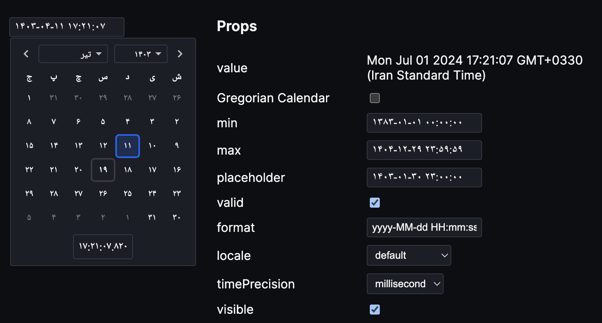
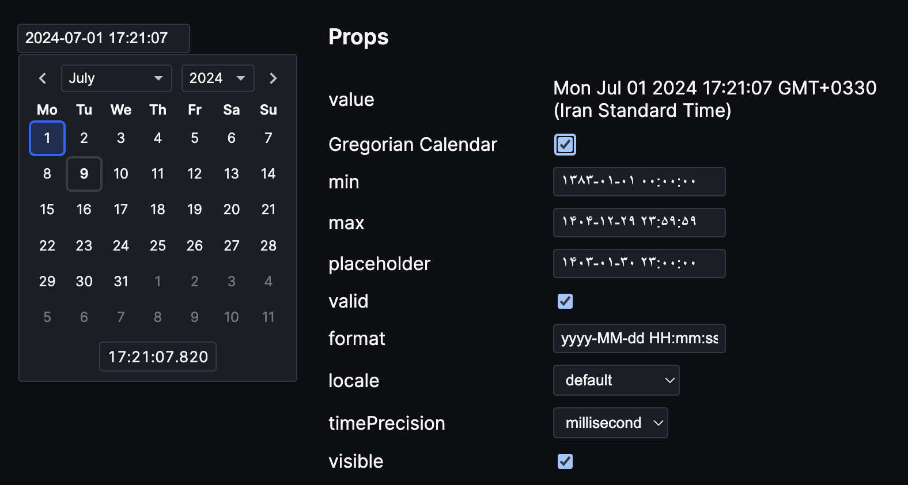

# Persian Date Picker Svelte

Persian Date Picker Svelte is a package which supports both Jalali and Gregorian calendars, inspired by [Date Picker Svelte](https://github.com/probablykasper/date-picker-svelte)

Features:
- Theming
- Custom formats
- Internationalization for the Gregorian Calendar (i18n)
- Auto-punctuation (e.g typing "20201111111111" gives you "2020-11-11 11:11:11" with the default format)
- Keyboard shortcuts

[Demo](https://github.com/nargeszmn/persian-date-picker-svelte/tree/master/src/routes/(demo))

# Documentation

## Install

```
npm install -D persian-date-picker-svelte
```

## Usage

```js
<script>
  import { DateInput } from 'persian-date-picker-svelte'
  let date = new Date()
  const calendarType = 'Jalali'
</script>

<DateInput bind:value={date} bind:calendarType/>
```



You can toggle between Jalali and Gregorian calendars by setting the `calendarType` prop to one of the `"Jalali" | "Gregorian"` values.

```js
<script>
  import { DateInput } from 'persian-date-picker-svelte'
  let date = new Date()
  const calendarType = 'Gregorian'
</script>

<DateInput bind:value={date} bind:calendarType/>
```



<h2 id="dateinput">DateInput</h2>

Component with an input field that shows the DatePicker component on focus.
The component will not assign a date value until a specific date is selected in the picker or entered into the field.

<h3 id="props">Props</h3>

| Prop                     | Type                                          | Description                                                   |
| :----------------------- | :-------------------------------------------- | :------------------------------------------------------------ |
| `calendarType`           | "Jalali" \| "Gregorian"                       | type of the calendar, default is Jalali                       |
| `value`                  | Date \| null                                  | Date value                                                    |
| `min`                    | Date                                          | The earliest value the user can select                        |
| `max`                    | Date                                          | The latest value the user can select                          |
| `placeholder`            | string                                        | Placeholder used when date value is null                      |
| `timePrecision`          | "minute" \| "second" \| "millisecond" \| null | Show a time picker with the specified precision               |
| `id`                     | string \| null                                | Set the input element's ID attribute                          |
| `valid`                  | bool                                          | Whether the text is valid                                     |
| `format`                 | string                                        | Format string                                                 |
| `visible`                | bool                                          | Whether the date popup is visible                             |
| `disabled`               | bool                                          | Disable the input                                             |
| `required`               | bool                                          | Require a value to submit form                                |
| `closeOnSelection`       | bool                                          | Close the date popup when a date is selected                  |
| `browseWithoutSelecting` | bool                                          | Wait with updating the date until a value is selected         |
| `dynamicPositioning`     | bool                                          | Dynamically postions the date popup to best fit on the screen |
| `locale`                 | Locale                                        | Locale object for internationalization                        |

<h4 id="format-string">Format string</h4>

Example format string: `yyyy-MM-dd HH:mm:ss`

| Pattern | Result example |
| :------ | :------------- |
| `yyyy`  | 2021           |
| `yy`    | 21             |
| `MM`    | 12             |
| `dd`    | 31             |
| `HH`    | 23             |
| `mm`    | 59             |
| `ss`    | 59             |

<h2 id="datepicker">DatePicker</h2>

Component with a calendar for choosing a date.
The component will not assign a date value until a specific date is selected in the picker.

<h3 id="datepicker-props">Props</h3>

| Prop                     | Type                                          | Description                                          |
| :----------------------- | :-------------------------------------------- | :--------------------------------------------------- |
| `calendarType`           | "Jalali" \| "Gregorian"                       | type of the calendar, default is Jalali              |
| `value`                  | Date \| null                                  | Date value                                           |
| `min`                    | Date                                          | The earliest year the user can select                |
| `max`                    | Date                                          | The latest year the user can select                  |
| `timePrecision`          | "minute" \| "second" \| "millisecond" \| null | Show a time picker with the specified precision      |
| `locale`                 | Locale                                        | Locale object for internationalization               |
| `browseWithoutSelecting` | bool                                          | Wait with updating the date until a date is selected |

<h2 id="internationalization">Internationalization</h2>

<h3 id="locale">`Locale`</h3>

Object to support internationalization. Properties (all are optional):

- `weekdays`: Array of weekdays in short form, Sunday to Monday. 
	- Default for Jalali calendar is: `['ی', 'د', 'س', 'چ', 'پ', 'ج', 'ش']`
	- Default for Gregorian calendar is: `['Su', 'Mo', 'Tu', 'We', 'Th', 'Fr', 'Sa']`
- `months`: Array of month names, January to December. 
	- Default for Jalali calendar is: `['فروردین','اردیبهشت','خرداد','تیر','مرداد','شهریور','مهر','آبان','آذر','دی','بهمن','اسفند']`
	- Default for Gregorian calendar is: `['January', 'February', 'March', 'April', 'May', 'June', 'July', 'August', 'September', 'October', 'November', 'December']`
- `weekStartsOn`: The day the week starts on, 0 = Sunday. 
	- Default for Jalali calendar is: `6`
	- Default for Gregorian calendar is: `1`

<h3 id="localefromdatefnslocale">`localeFromDateFnsLocale`</h3>

If you use [date-fns](https://date-fns.org/), you can create a Locale object (only for Gregorian calendar) by passing a date-fns locale to this function:

```js
<script>
  import { DatePicker, localeFromDateFnsLocale } from 'persian-date-picker-svelte'
  import { hy } from 'date-fns/locale'
  let date = new Date()
  let locale = localeFromDateFnsLocale(hy, 'Gregorian')
</script>

<DatePicker bind:value={date} {locale} />
```

<h2 id="css-variables">CSS variables</h2>

Colors:

- `--date-picker-foreground`
- `--date-picker-background`
- `--date-picker-highlight-border`
- `--date-picker-highlight-shadow`
- `--date-picker-selected-color`
- `--date-picker-selected-background`

Lengths:

- `--date-input-width`

Dark theme example:

```css
:root {
	--date-picker-background: #1b1e27;
	--date-picker-foreground: #f7f7f7;
}
```

## Inspirations
persian-date-picker-svelte is inspired by the great work of the developers of the following packages:

- #### [Date Picker Svelte](https://github.com/probablykasper/date-picker-svelte) : 
	Which provides the foundation for the date picker functionality in persian-date-picker-svelte.
- #### [date-fns-jalali](https://github.com/date-fns-jalali/date-fns-jalali) :
	This library enables Jalali calendar support within persian-date-picker-svelte.
